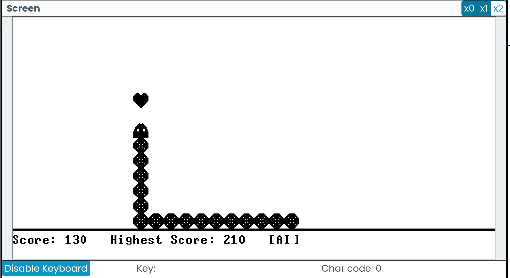
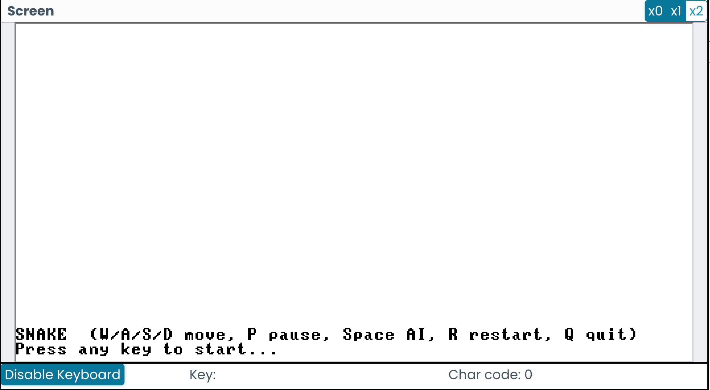
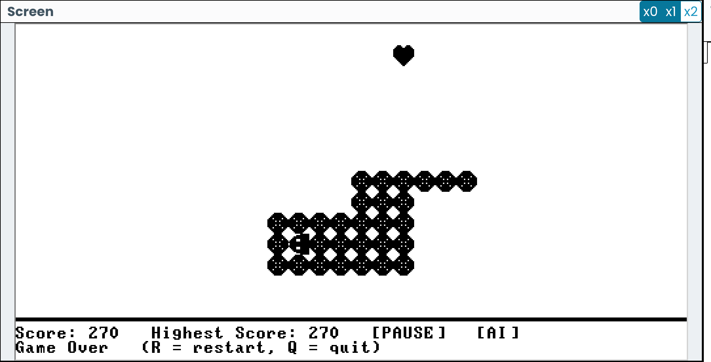

# Project 9 - Programming in Jack

1. Features

- Classic Snake Game.
- Keyboard controls (W/A/S/D) and pause/restart/quit keys.
- Scoring and highest-score tracking for the current run.
- Autopilot (simple greedy AI) that can be toggled on/off.
- Simple start animation and game over handling.
- Screen, Sys OS for rendering and timing.
- Using Bitmap for Snake and Food rendering.

2. Controls

- W / w : move up
- A / a : move left
- S / s : move down
- D / d : move right
- P / p : pause / unpause
- Space : toggle autopilot (AI)
- R / r : restart
- Q / q : quit

3. How to run

- Compile the Jack source files to VM code using NANDTeries' Jack Compiler.
- Run the vm code on NANDTeries' VM Emulator.
- Run the program. 
- Enable keybord input. Press any key to begin.

4. Gameplay details

- Grid cell size 16, visible area 512×256 pixels, 32×14 grid cells, last two line used to show instructions.
- The snake starts in the center with an initial length of 4.
- Food generates randomly at positions not occupied by the snake.
- Eating a food increases the snake length, awards +10 points, and trigger a new food generation.
- The game speeds up gradually as the snake grows.
- The game ends when the snake hits a wall or its own body.
- The autopilot uses a greedy strategy to move toward food while checking for collisions.
- Using staying time at the start page as the random seed.
- Memory safe: Strings are not allocated every frame; Snake arrays are properly disposed and recreated on reset; No heap overflow.

